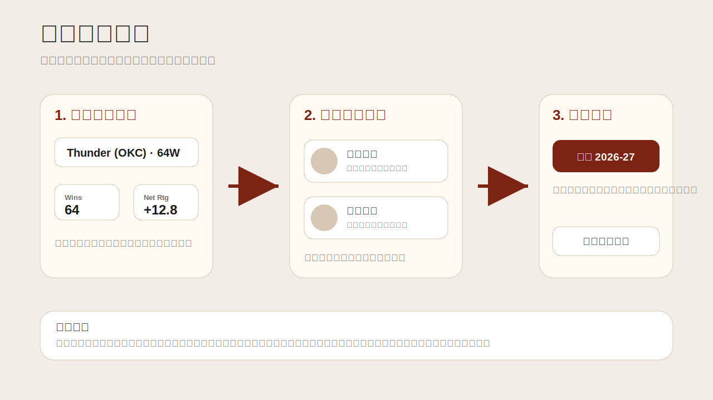
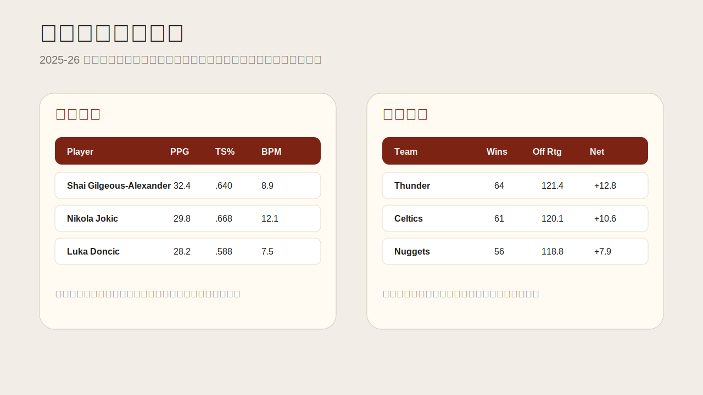
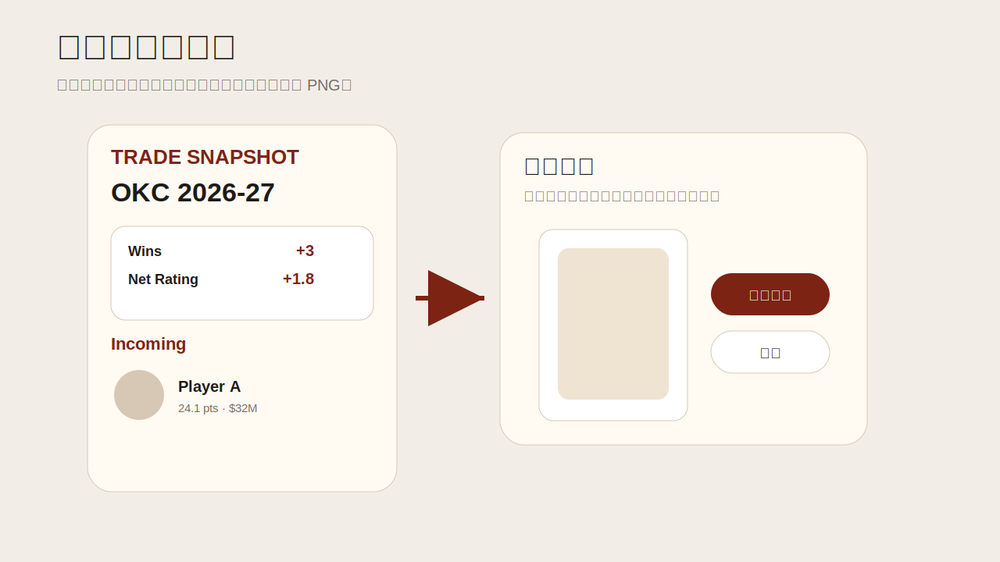

# 纸上谈球 Paper Hoops

[English](README.md)

<p align="center">
  
</p>

纸上谈球是一个 NBA 阵容变动与交易影响模拟网站。它整合 1975-76 至 2025-26 的球员和球队赛季数据，以 2025-26 当前阵容为基线，预测交易发生后球队在 2026-27 赛季的表现变化。

**在线访问：** 公开站点链接待更新

## 功能简介

- **交易模拟**：选择目标球队、移出球员和移入球员，生成交易后的 2026-27 球队预测。
- **球队预测**：展示胜场、胜率、节奏、进攻效率、防守效率、净效率等核心指标变化。
- **球员数据**：浏览 2025-26 球员基础数据、投篮效率、薪资和影响力指标，支持排序与分页。
- **球队数据**：按东西部查看 2025-26 球队战绩和效率数据。
- **海报生成**：生成精简版和完整版交易结果海报，先预览，再由用户选择是否下载 PNG。
- **移动端适配**：移动端使用更紧凑的交易模拟流程，减少信息拥挤。
- **中英文切换**：页面文本、表格标签、弹窗和海报文案支持中文/英文切换。







## 技术栈

- Python 3.11+
- 原生 `ThreadingHTTPServer` Web 服务
- NumPy / pandas / scipy / scikit-learn
- HTML / CSS / JavaScript 单页前端
- Docker 可选运行

网站运行时使用 NumPy 推理包，不需要在 Web 服务中导入 PyTorch。公开仓库只包含推理运行代码、模型参数包和网站运行所需的最小数据快照。

## 项目结构

```text
.
├── app/
│   ├── trade_simulator_server.py   # Web 服务与 API
│   └── static/index.html           # 单页前端
├── assets/                         # 头像、Logo、薪资、名单、影响力指标等资源
├── code/                           # 推理运行代码与 NumPy 推理产物
├── runtime_data/                   # 网站运行所需的最小公开数据快照
├── docs/                           # 部署说明与 README 图片素材
├── Dockerfile
├── requirements.txt
└── render.yaml
```

## 本地部署

### 1. 克隆项目

```bash
git clone https://github.com/<owner>/<repo>.git
cd <repo>
```

### 2. 创建 Python 环境

macOS / Linux:

```bash
python3 -m venv .venv
source .venv/bin/activate
python -m pip install --upgrade pip
pip install -r requirements.txt
```

Windows PowerShell:

```powershell
py -3.11 -m venv .venv
.\.venv\Scripts\Activate.ps1
python -m pip install --upgrade pip
pip install -r requirements.txt
```

### 3. 启动服务

```bash
python app/trade_simulator_server.py
```

默认访问地址：

```text
http://127.0.0.1:8765/
```

如需指定端口：

macOS / Linux:

```bash
PORT=8766 python app/trade_simulator_server.py
```

Windows PowerShell:

```powershell
$env:PORT="8766"
python app/trade_simulator_server.py
```

### 4. 验证服务

```bash
curl http://127.0.0.1:8765/healthz
curl http://127.0.0.1:8765/api/teams
```

PowerShell:

```powershell
Invoke-RestMethod 'http://127.0.0.1:8765/healthz'
Invoke-RestMethod 'http://127.0.0.1:8765/api/teams'
```

预期结果：

- `/healthz` 返回服务健康状态和当前赛季。
- `/api/teams` 返回 30 支球队。
- 浏览器打开 `/` 后可以看到首页、交易预测、球员数据和球队数据。

## Docker 运行

构建镜像：

```bash
docker build -t paper-hoops .
```

运行容器：

```bash
docker run --rm -p 8765:8765 paper-hoops
```

打开：

```text
http://127.0.0.1:8765/
```

## 常用 API

| 路径 | 方法 | 说明 |
| --- | --- | --- |
| `/` | GET | 前端首页 |
| `/healthz` | GET | 健康检查 |
| `/api/teams` | GET | 当前赛季球队列表 |
| `/api/team_view?team=OKC` | GET | 球队当前状态、阵容和默认移出项 |
| `/api/players_by_team?team=LAL&exclude_team=OKC` | GET | 按球队获取可移入球员 |
| `/api/player_stats` | GET | 球员数据表 |
| `/api/team_stats` | GET | 球队数据表 |
| `/api/simulate` | POST | 交易模拟 |

交易模拟请求示例：

```json
{
  "team": "OKC",
  "outgoing": ["Player A"],
  "incoming": ["Player B"]
}
```

## 数据与模型

- 当前应用使用 2025-26 赛季球员和球队数据作为当前状态，并预测 2026-27。
- 公开运行数据位于 `runtime_data/`。
- Web 推理依赖 `code/outputs/**/weights.npz` 和 `preprocessing.pkl`。
- 训练代码、历史全量数据、实验报告和模型优化细节不包含在公开版本中。
- 低覆盖率高级指标会在前端暂时隐藏或以空值处理，不会填充为 0。

## 开发者

雨田

## 免责声明

本项目为个人学习、研究和球迷交流项目，不隶属于 NBA、NBA 球队或任何官方数据提供方。项目中的球队、球员、薪资、头像和统计数据可能来自公开数据源或本地整理结果，仅供研究与娱乐参考，不应作为商业决策或官方记录使用。
